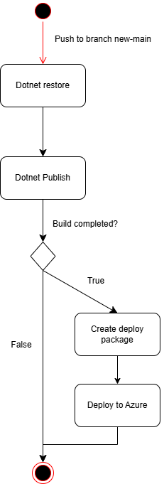
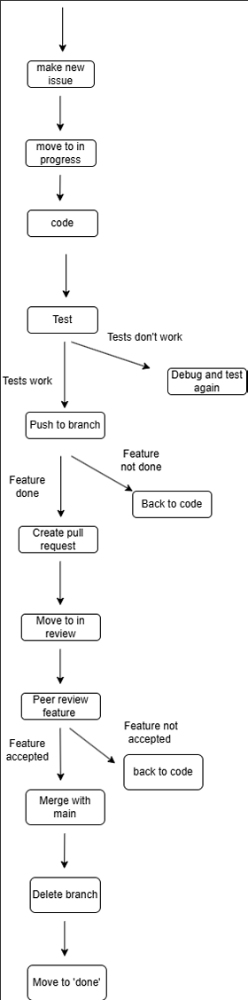
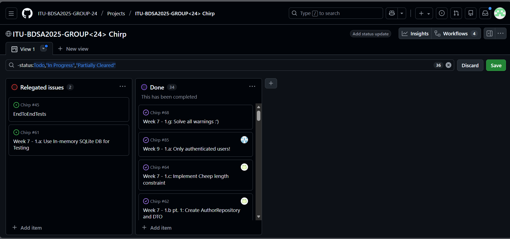

---
Title: Chirp Project Report
Subtitle: ITU BDSA 2025 GROUP 24 
Course Title: Analysis, Design, and Software Architecture
Course code: BSANDSA1KU
Authors: 
  - Aron Hansen                               <arha@itu.dk>
  - Christoffer Harboe Hjørtdal Andersen     <chria@itu.dk>
  - Line Juul Kabbeltved Præstegaard          <ljni@itu.dk>
  - Phongchai Chou                            <phoc@itu.dk>
  - Radmehr Shafaat                           <rads@itu.dk>
numbersections: true
---

# Chirp Project Report
## ITU BDSA 2025 GROUP 24
### Course title: Analysis, Design, and Software Architecture
### Course code: BSANDSA1KU
### Authors
Aron Hansen - <arha@itu.dk>  

Christoffer Harboe Hjørtdal Andersen - <chria@itu.dk>  

Line Juul Kabbeltved Præstegaard - <ljni@itu.dk>  

Phongchai Chou - <phoc@itu.dk>  

Radmehr Shafaat - <rads@itu.dk>  

 

# Design and Architecture of Chirp

## Domain Model

Our domain model consists of two primary classes: Author and Cheep.
Authors can have zero to many Cheeps and can follow other Authors as
well as be followed by them. Each Cheep maintains a reference to a
single Author.

 

## Architecture --- In the Small

 

We have selected relevant classes to illustrate our onion architecture
implementation. A key characteristic of the onion architecture is that
dependencies flow inward, ensuring that the inner layers remain
independent of the outer layers. This dependency structure provides
loose coupling between layers and facilitates adaptability, as
modifications to outer layers can be made without affecting the inner
layers. The Program.cs file in Chirp.Web is responsible for creating
Razor pages, requesting Azure to render them, and managing database
access.

## Architecture of the Deployed Application

The deployed application follows a client-server architecture, allowing
multiple clients to establish concurrent connections to the database.
The database layer is structured with two components: a primary database
that handles the core application data and a secondary database
dedicated to storing user images.

 

## User Activities

### Unauthenticated User

The activity diagram below illustrates a typical user journey from an
unauthenticated user's perspective.

 

### Login

The activity diagram below illustrates the typical user journey for
logging into the Chirp application.

 

### Follow/Unfollow

The following activity diagram depicts the user workflow for following
and unfollowing authors within the Chirp application.

 

### Upload Profile Picture

The activity diagram below illustrates the typical user journey for
uploading a profile picture to a Chirp account.

 

### Forget Me

The activity diagram below illustrates a typical user journey for
account deletion.

 

## Sequence of Functionality/Calls Through Chirp!

The sequence diagram below depicts how data flows through the Chirp
application when a user logs in.

 

# Process

## Build, test, release, and deployment

### Build and Test

The build and test workflow compiles the program and runs tests to
detect compilation errors and warnings. The following activity diagram
depicts this process.

 

### Deploy

The deploy workflow is responsible for packaging the program and
deploying it to the Azure web app. The process is as follows:

 

### Release

The release workflow ensures that when a commit is tagged with a version
number, it will be published to GitHub as a new release.

 

## Team Work

The diagram bellow illustrates our development workflow, depicting the
processes involved at each step and the error-handling procedures for
addressing unexpected issues.

 

We have implemented all required functionalities for our project, but as
shown in the screenshot below, some testing issues still need to be
addressed.

## How to Make Chirp! Work Locally

To run Chirp! locally, first clone the Git repository:

    git clone https://github.com/ITU-BDSA2025-GROUP-24/Chirp

When the repository has been cloned, navigate to the
`Chirp/src/Chirp.Web` directory:

    cd Chirp/src/Chirp.Web

Next, set up a user secret containing a connection string using the
following command:

    dotnet user-secrets set "AzureStorage__ConnectionString" "[insert connection string]"

Here, `[insert connection string]` should be replaced with an Azure
Storage connection string. If the user are not in possession of the connection string, we have implemented a
Note that the connection string must be entered as one continuous
string.

Once the user secret has been created, the program can be run from the
same directory using one of the following commands:

    dotnet run
    
    dotnet watch

When the program is running, it can be accessed in a browser by
following the URL shown in the terminal, for example
`http://localhost:5273`.

## How to Run Test Suite Locally

To execute the tests, follow these steps:

1.  Open a terminal.

2.  Navigate to the project solution directory (i.e., the root folder of
    the project).

3.  Run the following command:

        dotnet test

Our test suites split our project into three stages:

1.  **Unit Tests** -- Test individual components to verify that their
    functionalities work as standalone.

2.  **Integration Tests** -- Run and test individual classes together as
    a whole, rather than in isolation.

3.  **End-to-End (E2E) Tests** -- Run with Playwright to test the
    overall functionality of the program from the perspective of end
    users.

# Ethics

## License

We have chosen the MIT License for our project

## LLMs, ChatGPT, CoPilot, and Others

We have occasionally used LLMs such as ChatGPT and Claude AI, primarily
to help understand and resolve errors and warnings, as well as to assist
with workflow development. Their use has been limited to guidance and
clarification of our work. When relevant, we have acknowledged their
contribution through co-authorship in commits to indicate LLM usage.
Additional note: On very few occasions, while working under time
pressure, we forgot to include the LLM as a co-author in our commits.
